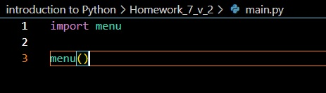
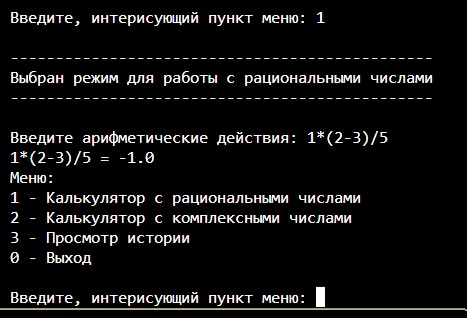
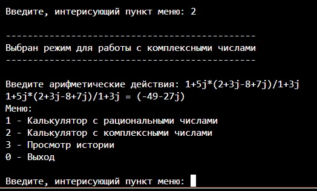
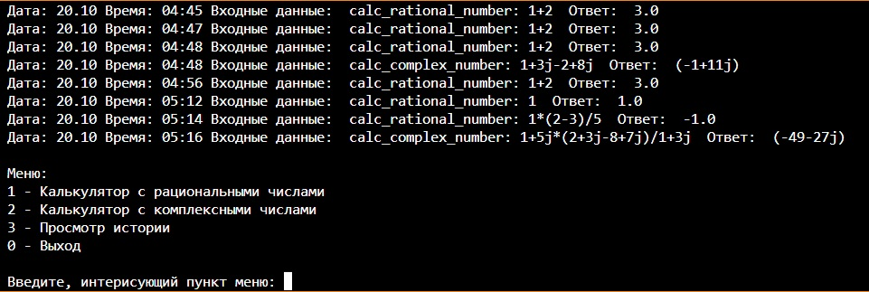

# РАДЫ ПРЕДСТАВИТЬ ВАШЕМУ ВНИМАНИЮ НАШ КАЛЬКУЛЯТОР
Кальеклятор млжет работать в режиме натуральных или комплексных вычислений и даже поддерживает работу со скобками.

# НА ЭТОМ МОИ СПОСОБНОСТИ "ПРОДАЖНИКА ВСЕ"
Поэтому я лучше раскажу, как это "чудо" работает. В общем попробую свои силы в беллетристике. Заранее прошу прощения за плоский юморю

# И так к делу
## ТОЧКОЙ ВХОДА
Точкой входа является модуль main

Модуль main Запускает модуль menu

## menu
Меню служит для выбора операции.

### Калькулятор с рациональными числами

### Калькулятор с комплексными числами

### Просмотр истории

## Описание работы
* Запуск программы осуществляется из модуля main
* main запускает модуль mene
* В зависимости, от выбранного пункта в меню будит запущен либо модуль controller, либо модуль loger, если выбрать пункт меню "Просмотреть историю"
* модуль controller:
    + запрашивает из модуля user_interface пользовательский ввод из функции get_expression
    + запускает выбранный калькулятор и передает ему введеное выражение (здесь, почему то не получилось реализовать апосредованый ввод данных через глобальную переменную)
    + передает результат  модулю user_interface на вывод в консоль, осуществляймый функцией view_data
    + запускает функцию write из модуля loger для записи в файл запроса пользователя и результата выполнения программы.
* Модуль calc_rational_numbers по суте подсмотренное решение не много доработанное, а именно добавлена работа со скобками и обработка исключений. Сам я к сожалению работал над собственным решением но не успел его реализовать, а старое решение не хотел использовать, он был прост и не интересен по этой причине решил разобраться в том что подсмотрел.
* Модуль calc_complex_numbers реализован через функцию eval так же добавлена обработка исключений.
* модуль user_interface отвечает за пользовательский ввод и вывод в консоль результата.
* loger отвечает за дабовление записи в файл и чтения из файла с последующим выводом в консоль

### РЕЗЮМЕ
Мы постарались реализовать модульную структуру таким образом, что б каждый модуль отвечал за свои действия:
+ запуск
+ выбор
+ ввод вывод, интерфейс пользоватнля
+ обработка данных
+ Ведение журнала работы
+ Модуль связывающий все модули вмести

