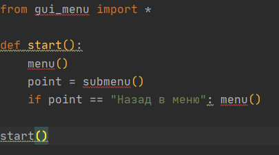
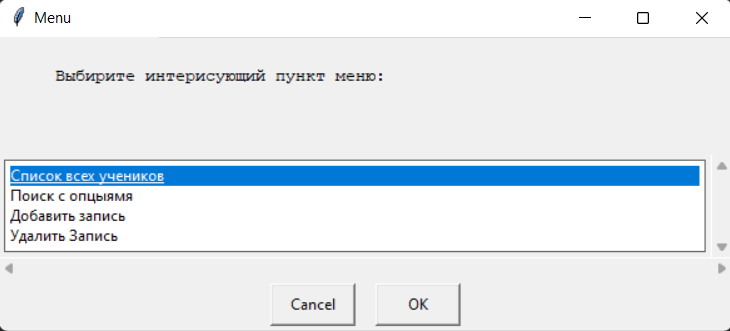
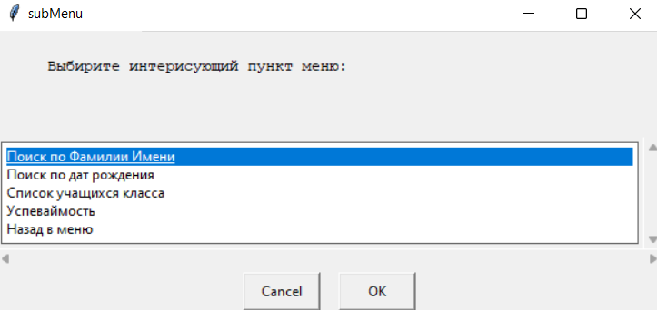
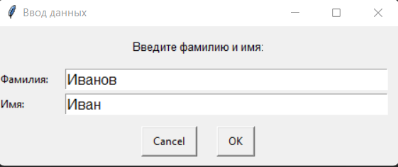

# Проект школа
Данный проект создан для быстрой и удобной работы с базой данных учеников.

Благодоря графическому интерфейсу приложением приятно и удобно пользоваться.
 
Здесь вы можете:
* Добавить ученика
* Удалить ученика
* Вывести весь список учеников

Еще есть поиска по критериям:
+ Поиск ученика по фамилии и имени
+ Поиск по дате рождения
+ Список учащихся интересующего вас класса
+ Поиск студентов по успеваймости
 
## Описание работы программы
+ Запуск программы осуществляется из модуля **main**

+ main запускает модуль **gui_menu** 
в котором вы можете выбрать интересующий вас пункт

+ Модуль **controller** принмает и обрабатывет запрос полученный от модуля **gui_menu** 

    + **controller** представляет собой модуль связывающий все модули вмести   
    
    + Взависимости от выбранного пунка меню, будет
    обрабатывать запрос и при необходимости пробрасовать его дальше в необходимый модуль
    
    + Если пользователь выбрал пункт с добавлением или удалением человека
    **controller** обращается к модулю **working_with_database**
    и с его помощью заносит или удаляет новую запись
    
   + С помощью модуля **search_data** ищет информацию необходимую пользователю
   + С помощью модуля **user_input** принимает данные от пользователя
        
+ Модуль **search_data** осуществляет поиск по запросу полученному от модуля **controller**

    + Поиск по фамилии и имени ученика
    + Поиск по дню рождения
    + Поиск по классу 
    + Поиск по успеваемости
    
    + **search_data** использует модуль **working_with_database** 
      для открытия файла в котором производится поиск необходимой информации
      
+ Модуль **working_with_database** выступает в роли 
    хранилища данных (информации по студентам)
    
    + Добавляет и удаляет записи
    + Открывает файл на чтения   
    + Сохраняет данные 
    
+ Модуль **user_input** принимает данные от пользователя

+ Модуль **gui_input_output**
    
    В нем заключена логика ввода и выввода информации в графический интерфейс

+ Модуль **loger** отвечает за запись истории в журанл и вывод истории в графический интерфейс

Над проектом работали:
Гаврилов Сергей и Муслимов Владислав 