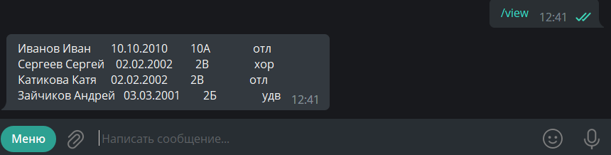

# School_bot
Этот бот представляет из себя информационную систему на базе школы

## Инструкция к использованию:
При старте бот проинформирует вас о меню, чтоб вы не потерялись

В меню находятся список команд, которые бот может выполнить

    
Команда **add** позволяет занести новую запись об учащемся

При добавлении новой записи бот попросит указать

+ Фамилию и Имя учащегося
+ Дату рождения
+ Класс
+ Успеваемость

Команда **delete** обратна команде **add**,
она удаляет запись из списка

Для удаления, необходимо указать только фамилию и имя ученика
запись о ктором вы хотите удалить

Команда **view** выводит список всех учеников на эран

Команда **search** позволяет пользователю осуществлять поиск предложенным критериям

Для выбора кретерия поиска пользователь должен нажать на кнопку с интересующим его поиском

Над проектом работали Муслимов Владислав и Гаврилов Сергей
